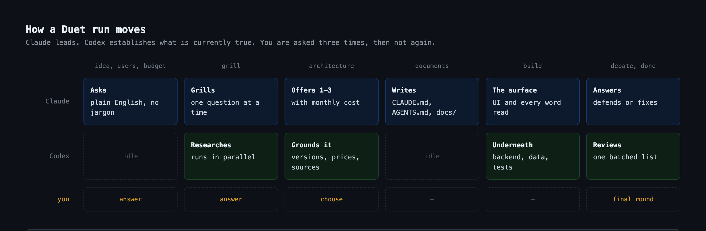
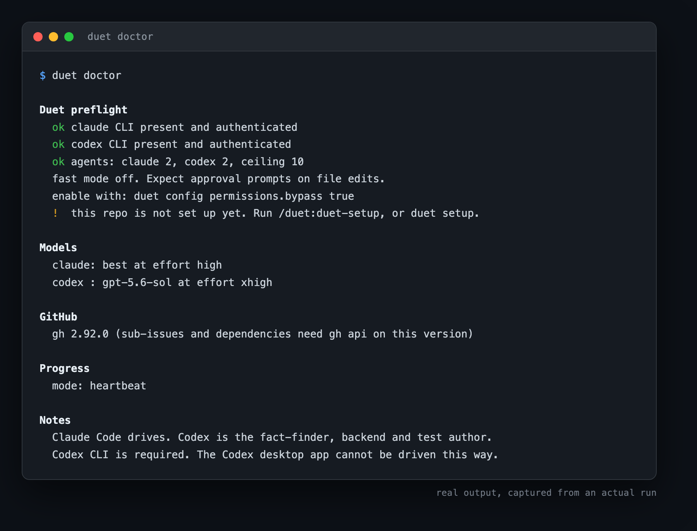
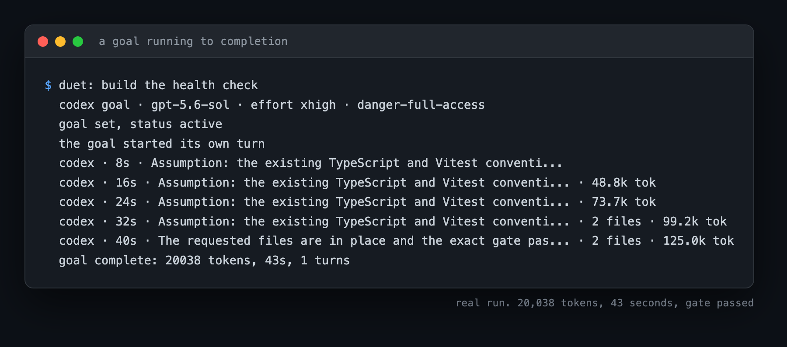
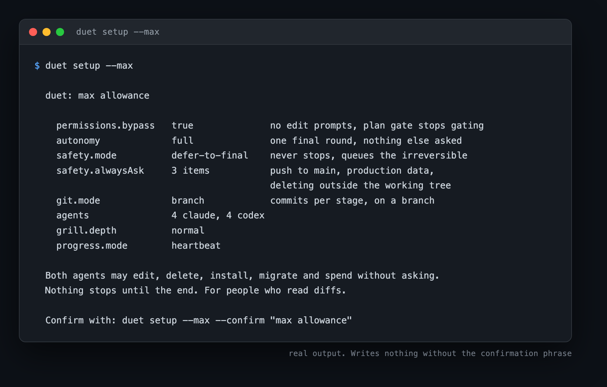
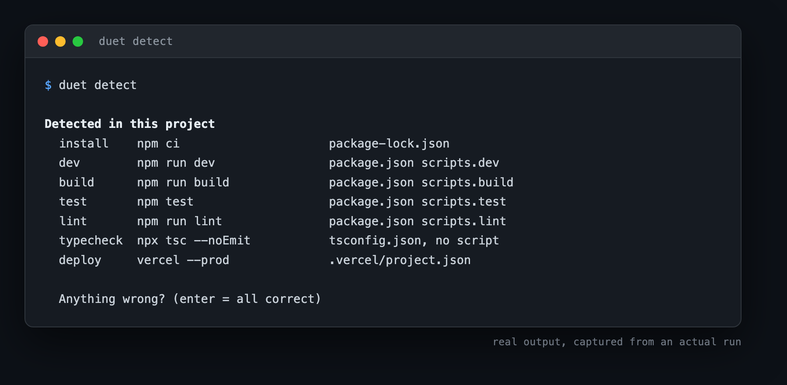
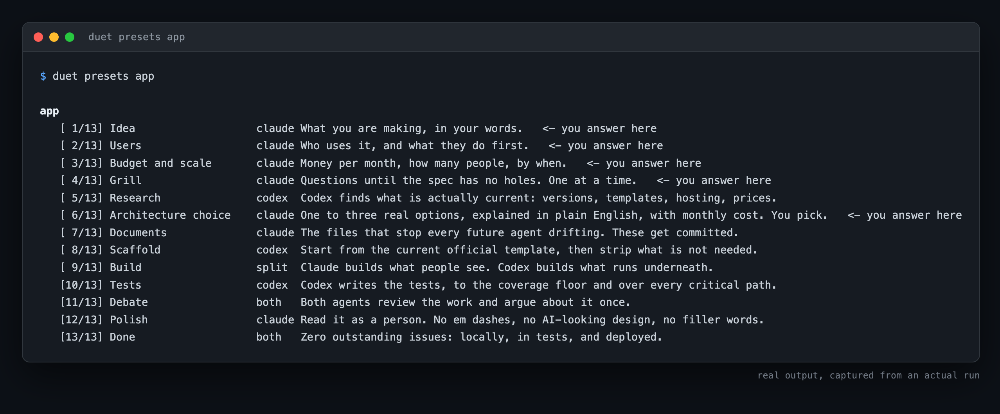

# Duet

You ask Claude to add Stripe subscriptions. It writes twenty confident lines
calling a method that was removed two versions ago. The code looks right. It
reviews well. It does not run.

That is not carelessness. **Its training data is older than your
dependencies**, and no amount of "please be careful" fixes a date problem.

Duet's answer: **Codex establishes the facts, then Claude writes the code.**

Codex is put to work reading current documentation, real API surfaces,
dependency versions and compatibility. Its findings are injected into Claude's
system prompt before Claude writes anything. Claude does what it is genuinely
good at, which is structure, logic and design, on top of facts it did not have
to remember.

Then they argue about the result, and you settle it.

And the work is handed over as a **goal**, not a prompt. A prompt ends when the
model stops talking. A goal ends when a command exits zero. That is the
difference between an app and most of an app.



---

## What it requires

- **Codex CLI.** Not the Codex desktop app. The app cannot be driven this way,
  and the resulting failure is baffling rather than obvious.
- **Claude Code.** Duet drives from here. Codex is the fact-finder, the backend
  and the test author; it does not orchestrate.
- Both logged in. Duet refuses to run on one agent, because with one agent it is
  not a degraded Duet, it is the CLI you already had.

## Install

One repo, both hosts. Codex reads Claude Code's plugin manifest format natively,
so there is nothing host-specific to install.

```bash
# Claude Code
/plugin marketplace add mikheilkuzmidi/duet
/plugin install duet@duet

# Codex, so it can be delegated to
codex plugin marketplace add mikheilkuzmidi/duet
codex plugin add duet@duet
```

Then, once per machine and once per repo:

```bash
duet doctor          # both CLIs, auth, models, caps
/duet:duet-setup     # ten questions, answers stay on this machine
```



## Use

Four jobs have fixed stages, because their shape is known in advance:

```
/duet:duet-app       build a new app from an idea
/duet:duet-rescue    repair an app that exists and works badly
/duet:duet-feature   add to a working project
/duet:duet-skill     build a new skill
```

Anything else, and the phases are generated for the task:

```
/duet:duet  add rate limiting to the API
```

The pieces also work on their own:

| | |
|---|---|
| `/duet:duet-research` | Codex checks what is currently true. No code written. |
| `/duet:duet-plan` | show the plan, run nothing |
| `/duet:duet-build` | run an approved plan |
| `/duet:duet-debate` | both agents review existing work, including work you wrote |
| `/duet:duet-resume` | continue a run that stopped |
| `/duet:duet-status` | which stage the run got to |
| `duet detect` | this project's install, test, lint and deploy commands |
| `duet gate <preset> <n>` | the command that decides whether stage n is done |

`/duet:duet-debate` on a branch you wrote by hand is probably the fastest way to
see whether this is useful to you.

In Codex, reach the same skills through `/skills`. Codex has no custom slash
commands, so onboarding is asymmetric and there is no way around that.

## Goals, and why work comes back finished

Codex has a first-party goals feature, and Duet drives it over the app-server
protocol. A goal carries an objective, a token budget, and a status that stays
`active` until the work is genuinely done. Hitting a usage limit moves it to
`usageLimited`, which is a state it recovers from rather than a death.

Every preset stage therefore ends in a **command**, not an opinion:

```
duet gate app 10          the command that decides whether stage 10 is done
  [10] Tests
       npm test -- --coverage
```

Those commands come from one detection pass at setup, so every gate in a project
agrees about what working means. A gate whose command is not configured fails
loudly and says which key is missing, rather than passing because there was
nothing to run.



That is a real run: Codex took the objective, worked unattended, stated its one
assumption in a line rather than stopping to ask, wrote exactly the two files it
was asked for, and finished when the gate command passed.

Claude has no goal API, so its side is the same property built from verified
parts: run, check the gate, resume the session, repeat until it passes.

## Autonomy

`autonomy` decides how much comes back to you mid-run.

| | |
|---|---|
| `full` | decides everything, every question waits for the finish |
| `product` | technical calls made alone, anything a person sees or reads stops at a gate |
| `off` | every gate stops and waits |

The split is by kind of decision rather than by frontend and backend, because
the frontend is full of purely technical calls nobody wants to be asked about,
and the line you actually care about is what the user ends up seeing.

## Nothing stops, and nothing irreversible happens either

`safety.alwaysAsk` is a short list of things a diff cannot undo: pushing to
`main`, touching production data, deleting outside the working tree. Short on
purpose, because a long stop-list gets switched off wholesale.

`safety.mode` decides what happens when one comes up:

- `ask-now` stops and waits.
- `defer-to-final` never stops. Duet declines to do it, queues it with its exact
  command and a recommendation, and carries on with everything else.

```bash
duet setup --max                              # shows what it turns on, writes nothing
duet setup --max --confirm "max allowance"    # then does it
```



Max allowance sets `defer-to-final`. It is not "no guards", it is **no
interruptions**, and conflating those is how people lose an afternoon to a force
push. The run is never interrupted, and the three unrecoverable things still
take one deliberate yes at the finish.

## Setup is per repo and per machine

Ten questions, asked once, in plain language, each with a recommended answer
already chosen, after a four line introduction and a count of what is coming:

how to talk to you, grilling depth, autonomy, what to never do without asking,
what to do when one of those comes up, whether to commit as you go, how many
agents a side, whether to show progress, whether to skip edit prompts, spend
limits, and the coverage floor.

Then it detects this project's install, test, lint and deploy commands and shows
them with the evidence for each guess, so you correct rather than type.



They land in `.duet/config.json` and `.duet/` is added to `.git/info/exclude`,
which is local and untracked. Your answers never travel, and your repository
shows no diff for having been set up.

What is deliberately **not** ignored: `CLAUDE.md`, `AGENTS.md` and `docs/`.
Those are the documents that stop the next agent drifting, and an anti-drift
document living on one laptop has failed at its job.

## How a preset run goes

Stages are fixed and numbered, so both agents can say where they are and you can
see what is left.

```
[1/13] Idea                 what you are making, in your words
[2/13] Users                who uses it, what they do first
[3/13] Budget and scale     money per month, how many people, by when
[4/13] Grill                questions until the spec has no holes
[5/13] Research             Codex finds what is actually current
[6/13] Architecture choice  you pick, in plain English      <- last question
[7/13] Documents            the files that stop agents drifting
[8/13] Scaffold             current official template, stripped
[9/13] Build                Claude the surface, Codex underneath
[10/13] Tests               to the coverage floor
[11/13] Debate              both agents argue once
[12/13] Polish              reads like a person wrote it
[13/13] Done                zero outstanding, three places
```

Stages 1 to 6 use no technical words. Somebody who has never opened a terminal
can answer all of them.

**Stage 6 is the last question about intent.** After it, everything accumulates
into one final round where each question arrives with a recommended answer
already selected, so the project finishes whether you answer all of them, some,
or none.



`duet presets` prints the other three.

## Rescue runs the order backwards, on purpose

Every instinct says pick the repair strategy first. That is how a rescue goes
wrong, because the strategy gets chosen against the broken app's own idea of
itself.

So `duet-rescue` reads the repo and tells **you** what it thinks the app does,
audits what actually runs, asks permission to delete the old documents, writes
the correct ones from evidence, and only then offers you three strategies: fix
in place, rebuild the backend behind the same frontend, or start over carrying
the environment and the data across.

Before it changes anything it writes down every behaviour that works today.
Without that list, "zero errors" is reachable by deleting whatever errors.

## Who owns what

Claude owns everything you see and every word you read: the frontend, the
labels, the buttons, the error messages. Codex owns everything underneath: the
backend, the data, the integrations, the tests.

Codex can raise a wording or interface concern. It files it with the exact
string and the reason. It does not edit it, and Claude decides.

## Rules, not rails

Duet carries [ten standing rules](reference/standing-rules.md) into every
delegated call. Each states what and why, because a rule you understand adapts
to a situation it never anticipated and a rule you merely obey does not.

Three of them are the ones this version is built around:

- **Brief without the answer.** A research request containing its own conclusion
  gets that conclusion back, and you will have paid for agreement and filed it
  as verification. Duet warns before sending a brief that reads as leading.
- **Repair the defect, not the feature.** Deleting behaviour to clear an error
  reaches zero errors without fixing anything.
- **Say less.** Six lines per turn outside a question or a final report.

**Nothing enforces them.** An agent may depart from any rule when the task calls
for it, but it has to say so, and the departure appears on the plan you approve.
Departing is allowed. Departing silently is not.

## Knowing it is alive

A four minute silent phase and a hung process look identical from the outside.
`progress.mode` decides what you see:

| | |
|---|---|
| `off` | silence until the phase ends |
| `heartbeat` | one line a minute, parsed from Codex's own output stream. Free. |
| `digest` | that, plus a short summary of what Codex found every few minutes. **Uses extra quota.** |
| `window` | a second terminal running a live Codex session you can watch |

The window is not a trick. `codex app-server` is documented JSON-RPC, the TUI
ships a first-party `--remote` flag, and an external client starting a turn on a
thread it does not own is supported behaviour. It was verified end to end before
being built: see the `prototype/oq1-codex-remote-attach` branch.

```bash
pip install websockets    # the visible window only. Goals need nothing.
```

## Done means done

Both agents share one [definition](reference/definition-of-done.md): zero
outstanding issues locally, in the tests, and deployed. A check that cannot be
run yet is **recorded as outstanding, never skipped quietly.**

The fix loop that gets there is autonomous, and it may not finish by deleting
the thing that failed.

## Configuration

```bash
duet setup --show                    # what this repo answered
duet config agents.codex.max 4 local # change one, for this repo
duet config progress.mode digest     # change one, everywhere
```

Global by default, with a per-repo override. Duet writes nothing into your
repository except `.duet/`, and it excludes that locally.

## Limitations

Stated here rather than discovered later, because a tool whose entire premise is
refusing to overstate what it knows cannot have a README that overstates what it
does.

- **Most phases pay an extra Codex hop.** Splitting mixed phases into brief plus
  work is what keeps Claude honest, and it is not free. Briefs are cached within
  a run, and pure-logic phases skip them, but Duet is slower than one agent
  guessing confidently.
- **Spend visibility is partial, and less partial than it was.** Duet measures
  its own cost exactly, and `account/rateLimits/read` on the Codex app-server
  gives real remaining-quota figures: used percent, window length, reset time.
  Claude exposes no equivalent, so half the picture is still guesswork and the
  agent caps remain a blunt instrument for that half.
- **Onboarding is asymmetric.** Claude Code gets `/duet:*`. Codex does not
  support custom slash commands.
- **The heartbeat parser is defensive, not verified.** Codex's `--json` stream
  is confirmed to carry usage figures. The event names for tool activity are
  not, so the parser tries several shapes and falls back to elapsed time and
  event count rather than inventing an activity label.
- **Fast mode turns off your safety net.** `permissions.bypass true` passes
  `--dangerously-skip-permissions` to Claude and `danger-full-access` to Codex.
  It removes the constant "can I edit this file" prompts that make long runs
  unpleasant. It also means the plan approval gate stops stopping anything, and
  Claude's auto-mode classifier may refuse to launch delegated agents at all. If
  that happens Duet tells you exactly what happened instead of hanging. Off by
  default, offered once, never enabled silently.
- **Claude has no goal API.** Codex does, and Duet uses it. On Claude's side the
  same property is built out of parts that are verified: run, check the gate,
  resume the same session until it passes. It works, and it is a loop rather
  than a first-party mechanism, which is worth knowing.
- **Version 0.3.0.** The core loop works. Goals and the presets are new.

## About the screenshots

Every terminal image in this README is real output from a real run on a real
machine, not a mockup. The goal screenshot is an actual Codex goal completing in
43 seconds against a live API. A tool whose entire premise is refusing to state
what it has not verified cannot illustrate itself with invented sessions.

The one image that is not a capture is the flow diagram at the top, which is a
diagram and reads as one.

## Design notes

Every decision behind this, and the research that produced it, is in the
[issue tracker](https://github.com/mikheilkuzmidi/duet/issues?q=is%3Aissue).
[Issue #1](https://github.com/mikheilkuzmidi/duet/issues/1) is the map: what was
decided, why, and what was ruled out. The dead ends are recorded too, including
the ones that cost the most time.

## Credit

The decision-mapping approach that produced this repo was inspired by the
`wayfinder` skill from [mattpocock/skills](https://github.com/mattpocock/skills)
(MIT). Duet's mechanics are its own, but the idea of charting an effort as
decision tickets with a fog frontier came from there, and it deserves saying.

## Licence

MIT. See [LICENSE](LICENSE).
